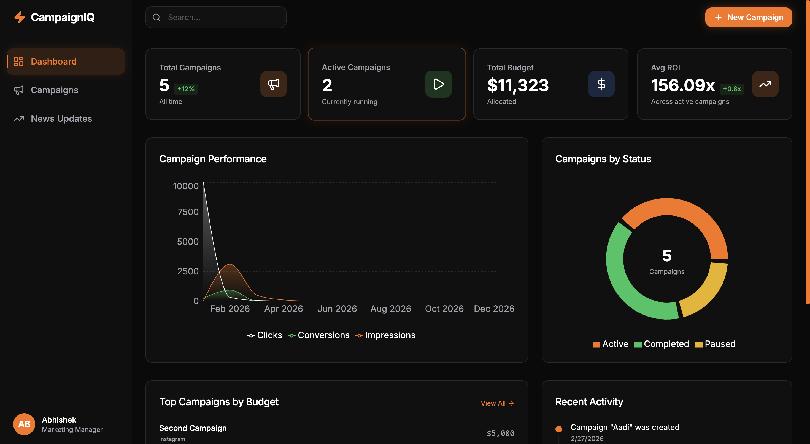

# Campaign Tracker Frontend

A modern, responsive dashboard for tracking marketing campaigns, visualizing performance metrics, and managing advertising budgets across multiple platforms.

## Links

- **Live Frontend**: [https://campaign-95e.pages.dev/](https://campaign-95e.pages.dev/)
- **Live Backend (API)**: [https://campaign-tracker-backend-eight.vercel.app/](https://campaign-tracker-backend-eight.vercel.app/)
- **Frontend Repo**: [https://github.com/Aadiprofessional/Campaign_Tracker_Frontend](https://github.com/Aadiprofessional/Campaign_Tracker_Frontend)
- **Backend Repo**: [https://github.com/Aadiprofessional/Campaign_Tracker_Backend](https://github.com/Aadiprofessional/Campaign_Tracker_Backend)

## Screenshots

### Dashboard


### Campaigns Management


### News Updates


## Features

- **Interactive Dashboard**: Real-time overview of campaign performance and budget allocation.
- **Campaign Management**: Create, edit, and track marketing campaigns.
- **Data Visualization**: Responsive charts for impressions, clicks, conversions, and ROI.
- **News Aggregation**: Real-time marketing news updates.
- **Responsive Design**: Optimized for desktop, tablet, and mobile.

## Tech Stack

- **Framework**: Next.js 14
- **Styling**: Tailwind CSS
- **Charts**: Recharts
- **Icons**: Lucide React
- **UI**: Radix UI / shadcn

## Local Development

1. **Clone the repo**
   ```bash
   git clone https://github.com/Aadiprofessional/Campaign_Tracker_Frontend.git
   cd Campaign_Tracker_Frontend
   ```

2. **Install dependencies**
   ```bash
   npm install
   ```

3. **Setup Environment**
   Copy `.env.example` to `.env.local` and add your backend URL:
   ```bash
   cp .env.example .env.local
   ```
   
   ```env
   NEXT_PUBLIC_API_URL=http://localhost:8000/api
   ```

4. **Run it**
   ```bash
   npm run dev
   ```
   Open [http://localhost:3000](http://localhost:3000).

## Deployment

The project is static-export ready. You can deploy the `out` folder to any static hosting service.

**Build for production:**
```bash
npm run build
```
This generates a static `out/` directory ready for upload.

**Cloudflare Pages:**
- Connect your repo.
- Build command: `npm run build`
- Output directory: `out`

**Vercel:**
- Standard Next.js deployment works out of the box.
